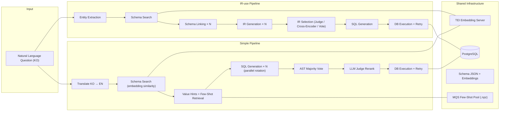
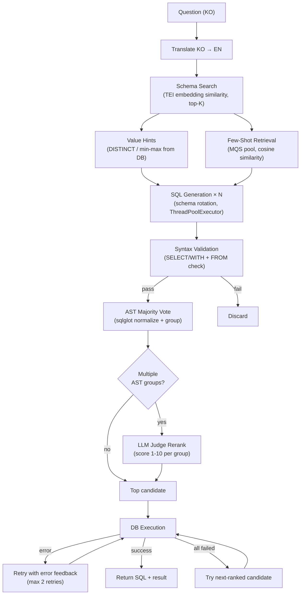
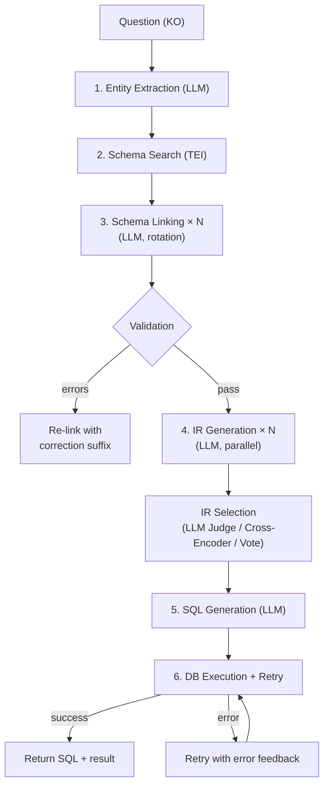
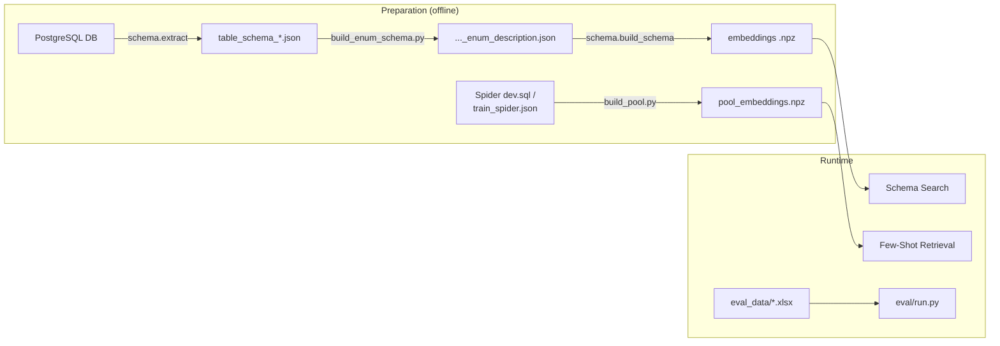

# Text-to-SQL Pipeline Exp

A PostgreSQL-based natural language → SQL pipeline for Korean enterprise data.  
Two execution paths are provided: **Simple pipeline** (lightweight) and **IR-use pipeline** (full).

---

## Architecture Overview



---

## Simple Pipeline

Skips the IR / schema-linking stages. Generates **N SQL candidates in parallel** via a vLLM server, then selects the best one through AST majority vote and LLM Judge.



### Key Components

| Component | Module | Description |
|-----------|--------|-------------|
| Schema Search | `schema/search.py` | Embedding-based table relevance ranking via TEI |
| Value Hints | `schema/value_hints.py` | Queries DB for actual column values (DISTINCT for text/enum, min/max for temporal) to reduce hallucination in WHERE clauses |
| Few-Shot (MQS) | `services/few_shot.py` | Masks `<table.column>` tags → embeds → cosine similarity against pre-built pool |
| SQL AST | `services/sql_ast.py` | sqlglot-based normalization; AND/OR operand sorting for order-invariant grouping |
| LLM Judge | `services/sql_judge.py` | Scores AST group representatives 1-10; includes LIMIT execution preview |
| Syntax Validator | `schema/validator.py` | Lightweight check (SELECT/WITH + FROM presence) |

### Run

```bash
python run.py simple --question "show unprocessed tasks"
```

---

## IR-use Pipeline

Full pipeline with intermediate representation. Extracts entities → links schema → generates IR → produces SQL.



### Run

```bash
python run.py ir-use --question "count alarms from yesterday"
```

---

## Project Structure

```
TAG-test/
├── run.py                    # Pipeline router (ir-use / simple)
├── .env.example              # Environment variable template
│
├── config/
│   ├── common.py             # Shared paths and parameters
│   ├── simple.py             # Simple pipeline tuning params
│   └── ir_use.py             # IR-use pipeline tuning params
│
├── pipelines/
│   ├── simple.py             # Simple pipeline implementation
│   └── ir_use.py             # IR-use pipeline implementation
│
├── clients/
│   ├── chat.py               # vLLM OpenAI-compatible client
│   ├── embed.py              # TEI embedding client
│   └── local.py              # Local transformers client (experimental)
│
├── services/
│   ├── sql_ast.py            # SQL AST normalization + majority vote
│   ├── sql_judge.py          # LLM Judge: rerank AST group representatives
│   ├── few_shot.py           # MQS-pool similar Q-SQL retrieval
│   ├── translate.py          # KO → EN translation
│   └── exec_preview.py       # LIMIT execution preview for Judge
│
├── schema/
│   ├── build_schema.py       # Build schema embeddings (.npz)
│   ├── search.py             # Schema similarity search (TEI)
│   ├── validator.py          # SL / IR / SQL validation
│   ├── value_hints.py        # Column value hints from DB
│   └── extract.py            # PostgreSQL schema → JSON
│
├── steps/                    # IR-use pipeline stages
│   ├── extract_entity.py
│   ├── schema_linking.py
│   ├── rewrite_query.py
│   └── generate_sql.py
│
├── ir/                       # IR selection strategies
│   ├── selector.py           # Majority vote
│   ├── reranker.py           # Cross-Encoder
│   ├── llm_judge.py          # LLM Judge
│   └── schema.py             # IR JSON schema definition
│
├── db/
│   └── client.py             # PostgreSQL execution util
│
├── prompts/
│   ├── simple/v1/            # Simple pipeline prompts (Jinja2)
│   └── ir-use/v10/           # IR-use pipeline prompts (Jinja2)
│
├── data/
│   └── schema/               # Schema JSON (table/column/ENUM descriptions)
│
├── MQS-pool/
│   └── build_pool.py         # Build few-shot embedding pool
│
├── eval/
│   └── run.py                # Batch evaluation runner
│
└── eval-analysis/
    ├── run.py                # Evaluation result analysis (LLM-based)
    └── .env.example          # OpenAI API key template
```

---

## Data Preparation

The pipeline requires three types of input data. All files go under `data/`.

### 1. Schema JSON (`data/schema/`)

Describes your PostgreSQL tables, columns, types, and descriptions. Two variants exist:

| File | Description |
|------|-------------|
| `table_schema_column_description.json` | Base schema (table + column descriptions) |
| `table_schema_column_enum_description.json` | Extended schema with `values` field for low-cardinality columns |

**Base format** — `table_schema_column_description.json`:

```json
[
  {
    "table": "alarm",
    "description": "Alarm master table defining codes, types, severity, and handling.",
    "columns": [
      { "name": "id",          "type": "integer",           "description": "Primary key" },
      { "name": "code",        "type": "character varying",  "description": "Alarm code" },
      { "name": "type",        "type": "character varying",  "description": "Alarm type" },
      { "name": "importance",  "type": "integer",           "description": "Severity level" },
      { "name": "create_date", "type": "timestamp",         "description": "Created at" },
      { "name": "valid_record","type": "boolean",           "description": "Is record valid" }
    ]
  },
  {
    "table": "alarm_history",
    "description": "Historical alarm occurrences with timestamps and resolution details.",
    "columns": [ ... ]
  }
]
```

**Extended format** — `table_schema_column_enum_description.json`:

Adds a `values` array to categorical columns (varchar/enum with low cardinality):

```json
{
  "name": "type",
  "type": "character varying",
  "description": "Alarm type",
  "values": ["EQUIPMENT", "SYSTEM", "NETWORK"]
}
```

> **Auto-generation**: Run `python data/schema/build_enum_schema.py` to query your DB for DISTINCT values and produce the enum-extended version from the base schema.

### 2. Evaluation Dataset (`data/eval_data/`)

An `.xlsx` file with natural language questions and ground-truth SQL. Required columns:

| Column | Required | Description |
|--------|----------|-------------|
| `번호` | yes | Row number |
| `대상 테이블` | no | Target table(s) — informational only |
| `자연어 질문` | yes | Natural language question |
| `정답 SQL` | yes | Ground-truth SQL |
| `SQL 실행 결과` | no | Expected execution result (for analysis) |
| `실행 난이도` | no | Difficulty label (e.g. `1`, `2`, `3` or `1-1`, `1-2`) |

**Example**:

| 번호 | 대상 테이블 | 자연어 질문 | 정답 SQL | 실행 난이도 |
|------|-------------|-------------|----------|-------------|
| 1 | alarm | 알람 코드별 발생 건수를 조회해줘 | SELECT code, COUNT(\*) FROM alarm_history GROUP BY code | 1 |
| 2 | equipment, alarm_history | 장비별 최근 알람 발생 일시를 조회해줘 | SELECT e.name, MAX(ah.create_date) FROM ... | 2 |

### 3. Few-Shot Pool (`MQS-pool/spider/`)

Pre-built Q-SQL pairs used as in-context examples during SQL generation.

**Input format** — `dev.sql` (one pair per 2 lines):

```
Question 1:  How many singers do we have ? ||| concert_singer
SQL:  select count(*) from singer

Question 2:  What are the names and ages of all singers? ||| concert_singer
SQL:  select name, age from singer
```

**Input format** — `train_spider.json` (Spider dataset format):

```json
[
  {
    "question": "How many singers do we have?",
    "query": "SELECT count(*) FROM singer",
    "question_toks": ["How", "many", "singers", ...],
    "query_toks": ["SELECT", "count", "(", "*", ")", ...]
  }
]
```

> After building, the pool is stored as `.npz` containing pre-computed embeddings, questions, and SQL arrays. See [Build Few-Shot Pool](#4-build-few-shot-pool-optional).

### Data Flow Summary



---

## Setup

### 1. Install Dependencies

```bash
pip install -r requirements.txt
```

### 2. Configure Environment

Copy `.env.example` to `.env` and fill in the values:

```bash
cp .env.example .env
```

| Variable | Description |
|----------|-------------|
| `DB_HOST` / `DB_NAME` / `DB_USER` / `DB_PASSWORD` | PostgreSQL connection |
| `VLLM_BASE_URL` / `VLLM_MODEL` | IR-use pipeline vLLM server |
| `SIMPLE_VLLM_BASE_URL` / `SIMPLE_VLLM_MODEL` | Simple pipeline vLLM server |
| `SIMPLE_SQL_JUDGE_BASE_URL` / `SIMPLE_SQL_JUDGE_MODEL` | LLM Judge + translation server |
| `TEI_BASE_URL` | TEI embedding server |
| `RERANKER_MODEL_PATH` | (Optional) Local cross-encoder model path |

### 3. Build Schema Embeddings

```bash
python -m schema.build_schema
```

Output: `artifacts/embeddings/*.npz`

### 4. Build Few-Shot Pool (Optional)

```bash
python MQS-pool/build_pool.py --source train
python MQS-pool/build_pool.py --source train --embed-lang en --embed-only
```

---

## Evaluation

### Batch Evaluation

```bash
# Default dataset
python eval/run.py simple
python eval/run.py ir-use

# Custom dataset
python eval/run.py simple --dataset SQL-dataset-multi.xlsx

# Resume from last checkpoint
python eval/run.py simple --resume
```

### Result Analysis

```bash
# LLM-based correctness analysis
python eval-analysis/run.py --pipeline simple --input path/to/result.xlsx
python eval-analysis/run.py --pipeline ir     --input path/to/result.xlsx

# Summary only (no LLM calls)
python eval-analysis/run.py --pipeline simple --input path/to/analysis.xlsx --summary-only
```

---

## Key Configuration

### Simple Pipeline (`config/simple.py`)

| Parameter | Default | Description |
|-----------|---------|-------------|
| `SIMPLE_N` | `16` | Number of SQL candidates to generate |
| `SIMPLE_SQL_SELECT_METHOD` | `"llm_judge"` | Selection method (`"llm_judge"` / `"ast_majority"`) |
| `SIMPLE_SQL_JUDGE_TOP_K` | `5` | Max AST groups sent to Judge |
| `SIMPLE_SQL_DB_MAX_RETRIES` | `2` | Max DB error retries per candidate |
| `SIMPLE_FEW_SHOT_TOP_K` | `3` | Number of few-shot examples |
| `SIMPLE_TRANSLATE_ENABLED` | `True` | Enable KO → EN translation |

### IR-use Pipeline (`config/ir_use.py`)

| Parameter | Default | Description |
|-----------|---------|-------------|
| `SL_CANDIDATES_N` | `3` | Schema linking candidates |
| `IR_CANDIDATES_N` | `3` | IR generation candidates |
| `IR_SELECT_METHOD` | `"llm_judge"` | IR selection (`"llm_judge"` / `"cross_encoder"` / `"majority_vote"`) |
| `SCHEMA_LINKING_MAX_RETRIES` | `2` | Max schema linking validation retries |
| `SQL_DB_MAX_RETRIES` | `2` | Max DB error retries |

### Shared (`config/common.py`)

| Parameter | Default | Description |
|-----------|---------|-------------|
| `SCHEMA_TOP_K` | `5` | Number of tables returned by schema search |
| `SQL_MAX_TOKENS` | `384` | Max tokens for SQL generation |
